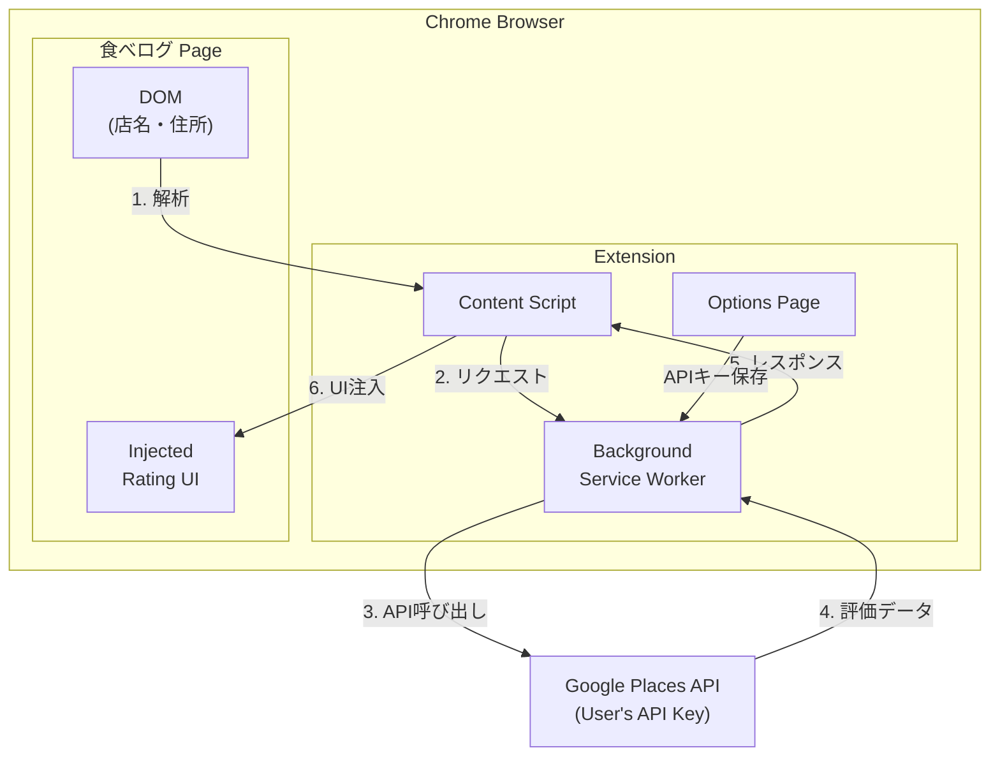
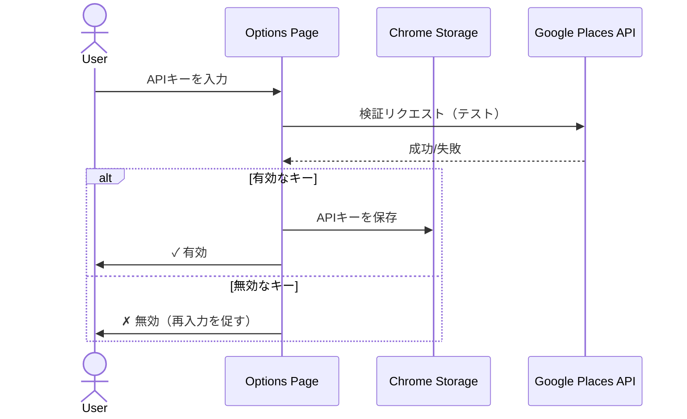
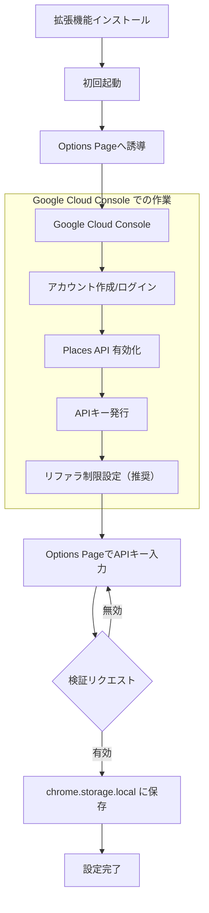
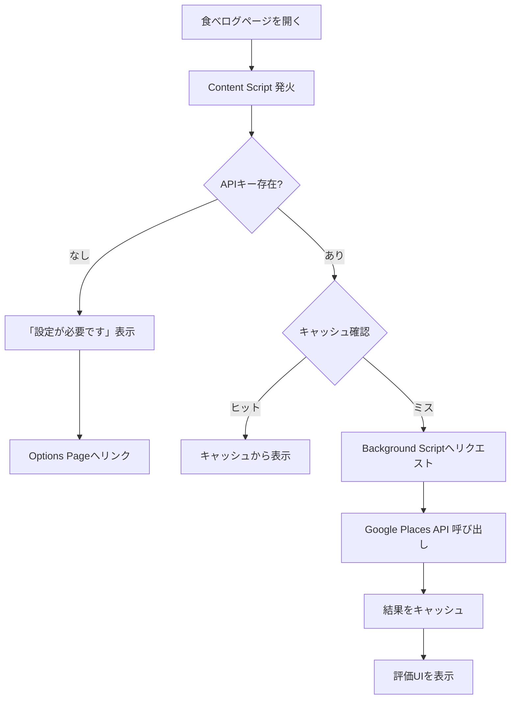

# Option A: ユーザーAPIキー方式

## 概要

ユーザーが自分のGoogle Places APIキーを取得・設定し、拡張機能内で使用する方式。
評価情報をページ内に直接表示できる。

---

## 1. アーキテクチャ



### Options Page フロー



---

## 2. コンポーネント構成

```
tabelog-gmap-extension/
├── manifest.json
├── src/
│   ├── content/
│   │   ├── index.ts          # Content Script エントリポイント
│   │   ├── parser.ts         # 食べログDOM解析
│   │   └── ui.ts             # 評価UI注入
│   ├── background/
│   │   └── service-worker.ts # API呼び出し
│   ├── options/
│   │   ├── options.html      # 設定ページ
│   │   └── options.ts        # APIキー管理
│   ├── types/
│   │   └── index.ts
│   └── utils/
│       ├── cache.ts          # キャッシュ処理
│       └── api-key.ts        # APIキー検証
├── popup/
│   ├── popup.html
│   └── popup.ts
└── assets/
    └── icons/
```

---

## 3. 主要フロー

### 3.1 初回設定フロー



### 3.2 評価取得フロー



---

## 4. データ設計

### 4.1 Chrome Storage

```typescript
interface StorageSchema {
  // ユーザー設定
  settings: {
    apiKey: string;          // ユーザーのAPIキー（暗号化推奨）
    enabled: boolean;
    showReviewCount: boolean;
  };

  // APIキー状態
  apiKeyStatus: {
    isValid: boolean;
    lastChecked: number;     // timestamp
    errorMessage?: string;
  };

  // キャッシュ
  cache: {
    [tabelogUrl: string]: {
      placeId: string;
      rating: number;
      userRatingsTotal: number;
      fetchedAt: number;
    };
  };
}
```

### 4.2 キャッシュ戦略

| 項目 | 値 | 理由 |
|------|-----|------|
| TTL | 7日間 | APIコスト削減のため長めに |
| 最大件数 | 500件 | ローカルストレージ容量考慮 |
| 削除戦略 | LRU | 最も古いアクセスを削除 |

---

## 5. Options Page 設計

### 5.1 UI

```
┌─────────────────────────────────────────────────────────────┐
│  Tabelog × Google Maps 設定                                 │
├─────────────────────────────────────────────────────────────┤
│                                                             │
│  【APIキー設定】                                             │
│                                                             │
│  Google Places API Key:                                     │
│  ┌─────────────────────────────────────────────┐ ┌────────┐│
│  │ AIzaSy...                                   │ │  保存  ││
│  └─────────────────────────────────────────────┘ └────────┘│
│                                                             │
│  ステータス: ✓ 有効 (最終確認: 2025/01/15 10:30)           │
│                                                             │
│  ────────────────────────────────────────────────────────  │
│                                                             │
│  【APIキーの取得方法】                                       │
│                                                             │
│  1. Google Cloud Console にアクセス                         │
│     → https://console.cloud.google.com/                    │
│                                                             │
│  2. プロジェクトを作成（または選択）                          │
│                                                             │
│  3. 「APIとサービス」→「ライブラリ」                         │
│     → 「Places API (New)」を有効化                          │
│                                                             │
│  4. 「認証情報」→「認証情報を作成」→「APIキー」              │
│                                                             │
│  5. APIキーの制限を設定（推奨）                              │
│     - HTTPリファラ: chrome-extension://*                   │
│     - API制限: Places API (New) のみ                       │
│                                                             │
│  ※ 月$200の無料枠があります（個人利用には十分）              │
│                                                             │
│  ────────────────────────────────────────────────────────  │
│                                                             │
│  【表示設定】                                                │
│                                                             │
│  ☑ 拡張機能を有効にする                                     │
│  ☑ レビュー件数を表示する                                   │
│                                                             │
│  ────────────────────────────────────────────────────────  │
│                                                             │
│  【キャッシュ】                                              │
│                                                             │
│  保存件数: 127件                                            │
│  ┌──────────────────┐                                       │
│  │  キャッシュクリア  │                                       │
│  └──────────────────┘                                       │
│                                                             │
└─────────────────────────────────────────────────────────────┘
```

### 5.2 APIキー検証

```typescript
async function validateApiKey(apiKey: string): Promise<boolean> {
  // テストリクエストを送信（東京駅など固定の場所で）
  const testUrl = `https://places.googleapis.com/v1/places:searchText`;
  const response = await fetch(testUrl, {
    method: 'POST',
    headers: {
      'Content-Type': 'application/json',
      'X-Goog-Api-Key': apiKey,
      'X-Goog-FieldMask': 'places.displayName'
    },
    body: JSON.stringify({
      textQuery: '東京駅',
      maxResultCount: 1
    })
  });

  return response.ok;
}
```

---

## 6. エラーハンドリング

| エラー | 検出方法 | ユーザーへの表示 | 対応 |
|--------|---------|----------------|------|
| APIキー未設定 | storage確認 | 「設定が必要です」+ リンク | Options Pageへ誘導 |
| APIキー無効 | 401エラー | 「APIキーが無効です」 | 再設定を促す |
| API制限超過 | 429エラー | 「本日の利用上限に達しました」 | 翌日まで待機 |
| ネットワークエラー | fetch失敗 | 「接続エラー」+ リトライボタン | 3回までリトライ |
| 店舗見つからず | 空レスポンス | 「Google Mapに該当なし」 | リンクのみ表示 |

---

## 7. セキュリティ

### 7.1 APIキーの保護

- `chrome.storage.local` に保存（sync は避ける：複数デバイス間でキー共有のリスク）
- Content Script には直接露出しない（Background経由でAPI呼び出し）
- ユーザーにリファラ制限設定を推奨

### 7.2 リファラ制限の案内

```
推奨設定:
- アプリケーションの制限: HTTPリファラ
- リファラ: chrome-extension://{extension-id}/*

※ extension-id はインストール後に確認可能
```

---

## 8. メリット・デメリット

### メリット

| 項目 | 説明 |
|------|------|
| 費用負担なし | 開発者がAPI費用を負担しない |
| スケーラブル | ユーザー数に関係なく動作 |
| 機能完全 | 評価をページ内に直接表示 |
| 無料枠十分 | 個人利用なら月$200で十分 |

### デメリット

| 項目 | 説明 |
|------|------|
| 敷居が高い | Google Cloud登録が必要 |
| 離脱リスク | 設定完了前に離脱する可能性 |
| サポート負荷 | 「設定方法がわからない」問い合わせ |
| ターゲット限定 | 技術に明るいユーザー向け |

---

## 9. 想定ユーザー

- エンジニア・技術者
- APIキーの概念を理解している人
- Google Cloud を使ったことがある人
- 「設定は面倒だが、便利なら使う」という人

---

## 10. 実装優先度

### Phase 1（MVP）

1. Options Page（APIキー入力・検証）
2. Content Script（DOM解析・UI注入）
3. Background Script（API呼び出し）
4. 基本的なエラーハンドリング

### Phase 2

1. キャッシュ機能
2. 詳細な設定オプション
3. 複数店舗の一括処理（検索結果ページ）

---

## 11. 参考: Google Cloud 設定手順（ユーザー向けドキュメント）

別途 `docs/SETUP-API-KEY.md` として作成予定。スクリーンショット付きの詳細手順。
