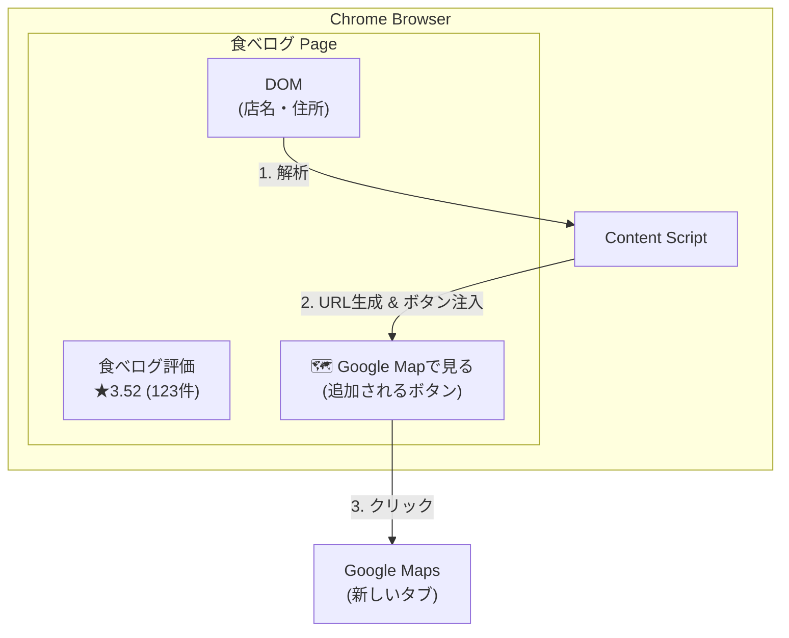
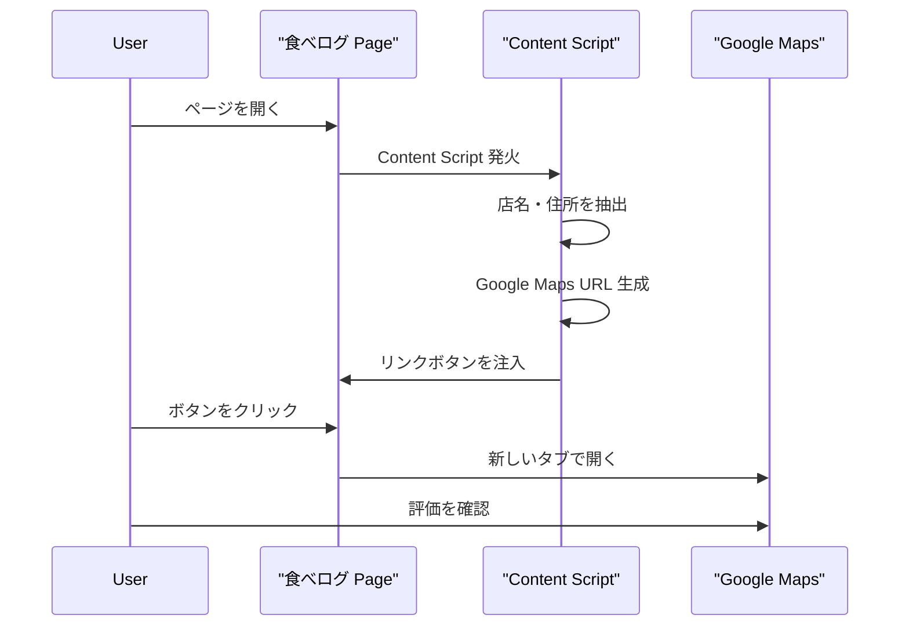
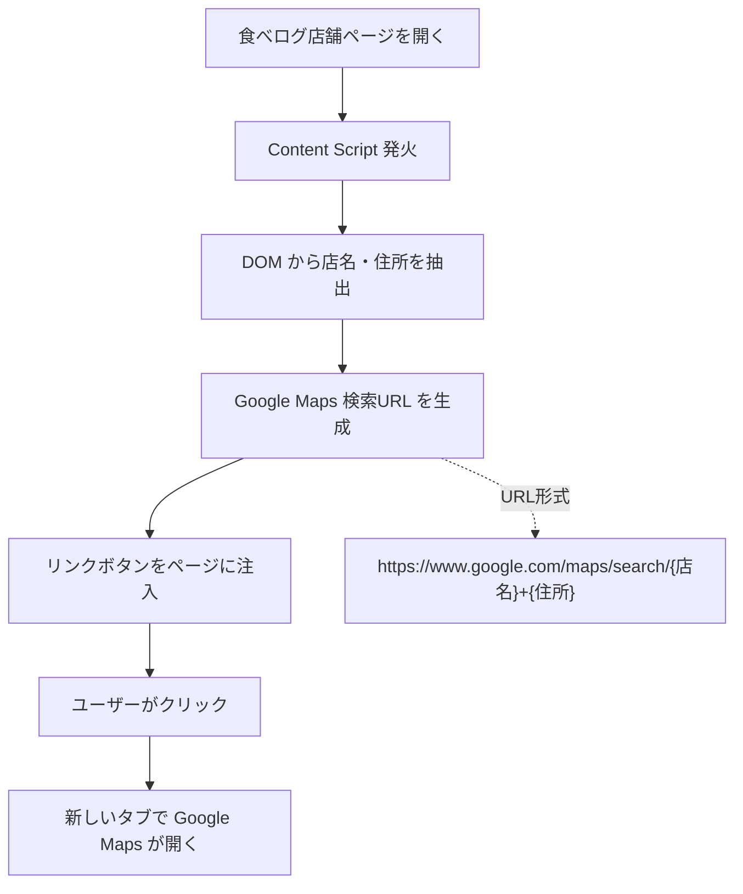

# Option B: リンクのみ方式

## 概要

API を使用せず、食べログページに Google マップへのリンクボタンを追加する方式。
ユーザーはワンクリックで該当店舗の Google マップ検索結果に遷移できる。

---

## 1. アーキテクチャ



### ユーザー体験フロー



---

## 2. コンポーネント構成

```
tabelog-gmap-extension/
├── manifest.json
├── src/
│   ├── content/
│   │   ├── index.ts          # Content Script エントリポイント
│   │   ├── parser.ts         # 食べログDOM解析
│   │   └── ui.ts             # リンクボタンUI注入
│   └── types/
│       └── index.ts
├── popup/
│   ├── popup.html            # シンプルな説明のみ
│   └── popup.ts
└── assets/
    └── icons/
```

**注目点**: Background Script が不要。Content Script のみで完結。

---

## 3. 主要フロー



---

## 4. データ設計

### 4.1 Chrome Storage

```typescript
interface StorageSchema {
  // 設定（シンプル）
  settings: {
    enabled: boolean;
    openInNewTab: boolean;  // 新しいタブで開くか
  };
}
```

**注目点**: キャッシュ不要、APIキー不要。非常にシンプル。

---

## 5. URL生成ロジック

### 5.1 基本形式

```typescript
function generateGoogleMapsUrl(name: string, address: string): string {
  const query = encodeURIComponent(`${name} ${address}`);
  return `https://www.google.com/maps/search/${query}`;
}
```

### 5.2 検索精度向上のオプション

```typescript
// オプション1: 住所のみ（店名が一般的すぎる場合）
function generateUrlByAddress(address: string): string {
  return `https://www.google.com/maps/search/${encodeURIComponent(address)}`;
}

// オプション2: 座標指定（食べログに緯度経度がある場合）
function generateUrlWithCoords(name: string, lat: number, lng: number): string {
  const query = encodeURIComponent(name);
  return `https://www.google.com/maps/search/${query}/@${lat},${lng},17z`;
}
```

---

## 6. UI設計

### 6.1 リンクボタンのデザイン案

```
案A: テキストリンク
┌────────────────────────────────────────────┐
│  食べログ評価: ★3.52 (123件)              │
│  📍 Google Mapで確認する                   │  ← シンプルなリンク
└────────────────────────────────────────────┘

案B: ボタン形式
┌────────────────────────────────────────────┐
│  食べログ評価: ★3.52 (123件)              │
│  ┌────────────────────────┐               │
│  │ 🗺️ Google Mapで見る   │               │  ← 目立つボタン
│  └────────────────────────┘               │
└────────────────────────────────────────────┘

案C: アイコンのみ
┌────────────────────────────────────────────┐
│  食べログ評価: ★3.52 (123件)    [G]       │  ← 最小限
└────────────────────────────────────────────┘
```

### 6.2 推奨デザイン

**案B（ボタン形式）** を推奨。理由：
- 発見しやすい
- クリック領域が広い
- 拡張機能の存在価値が伝わる

### 6.3 スタイル詳細

```css
.gmap-link-button {
  display: inline-flex;
  align-items: center;
  gap: 6px;
  padding: 8px 16px;
  background: #4285f4;          /* Google Blue */
  color: white;
  border-radius: 4px;
  font-size: 14px;
  font-weight: 500;
  text-decoration: none;
  transition: background 0.2s;
}

.gmap-link-button:hover {
  background: #3367d6;
}

.gmap-link-button::before {
  content: '';
  width: 18px;
  height: 18px;
  background-image: url('google-maps-icon.svg');
  background-size: contain;
}
```

---

## 7. DOM解析

### 7.1 抽出対象

```typescript
interface RestaurantInfo {
  name: string;      // 必須
  address: string;   // 必須
}

// 電話番号は不要（リンク生成には使わない）
```

### 7.2 セレクタ（要検証）

```typescript
// 店名
const nameElement = document.querySelector('.rstinfo-table__name');
const name = nameElement?.textContent?.trim();

// 住所
const addressElement = document.querySelector('.rstinfo-table__address');
const address = addressElement?.textContent?.trim();
```

**注意**: 食べログのDOM構造は変更される可能性があるため、複数のセレクタを用意しておく。

---

## 8. エラーハンドリング

| 状況 | 対応 |
|------|------|
| 店名が取得できない | ボタンを表示しない |
| 住所が取得できない | 店名のみで検索URLを生成 |
| DOM構造が変更された | エラーログ出力、graceful degradation |

**シンプルなので、エラーケースが少ない。**

---

## 9. Manifest.json

```json
{
  "manifest_version": 3,
  "name": "食べログ → Google Map リンク",
  "version": "1.0.0",
  "description": "食べログの店舗ページからワンクリックでGoogle Mapを開けます",

  "permissions": [
    "storage"
  ],

  "content_scripts": [
    {
      "matches": [
        "*://tabelog.com/*"
      ],
      "js": ["src/content/index.js"],
      "css": ["src/content/styles.css"]
    }
  ],

  "action": {
    "default_popup": "popup/popup.html",
    "default_icon": {
      "16": "assets/icons/icon16.png",
      "48": "assets/icons/icon48.png",
      "128": "assets/icons/icon128.png"
    }
  },

  "icons": {
    "16": "assets/icons/icon16.png",
    "48": "assets/icons/icon48.png",
    "128": "assets/icons/icon128.png"
  }
}
```

**注目点**:
- `host_permissions` 不要（外部APIを呼ばないため）
- `background` 不要
- 非常にシンプルなパーミッション

---

## 10. メリット・デメリット

### メリット

| 項目 | 説明 |
|------|------|
| 設定不要 | インストールするだけで動作 |
| 費用ゼロ | APIを使わないので完全無料 |
| シンプル | 実装が簡単、バグが少ない |
| 一般向け | 技術知識不要で誰でも使える |
| 審査通過しやすい | 外部API通信がないので安全 |
| メンテナンス楽 | API変更の影響を受けない |

### デメリット

| 項目 | 説明 |
|------|------|
| 機能限定 | 評価をページ内に表示できない |
| ワンクリック必要 | 自動で評価が見えるわけではない |
| 検索精度 | Google検索に依存（たまに違う店が出る） |
| 差別化弱い | 「リンクを開くだけ」は価値が伝わりにくい |

---

## 11. 想定ユーザー

- 一般ユーザー（技術知識不要）
- 「食べログとGoogleの評価を両方見たい」人
- 「手軽に使いたい」人
- APIキー設定が面倒な人

---

## 12. 実装工数

### 見積もり

| タスク | 工数 |
|--------|------|
| Manifest.json 設定 | 0.5h |
| DOM解析（parser.ts） | 1h |
| UI注入（ui.ts） | 1h |
| スタイリング | 0.5h |
| ポップアップ | 0.5h |
| テスト・デバッグ | 1h |
| **合計** | **約4-5時間** |

Option A（APIキー方式）の **1/3〜1/4 の工数** で実装可能。

---

## 13. 将来の拡張可能性

### Option A への移行パス

この方式で公開後、ユーザーが増えてきたら：

1. Option A（APIキー方式）を **追加機能** として実装
2. デフォルトはリンクのみ（設定不要）
3. APIキーを設定したユーザーのみ評価表示

**段階的アプローチ** が可能。

### その他の拡張案

- [ ] 検索結果ページでの一括リンク表示
- [ ] 右クリックメニューから Google Map を開く
- [ ] キーボードショートカット対応

---

## 14. 競合との差別化

既存の Sinhalite 氏の拡張機能と同様の方式だが：

| 項目 | 既存 | 本プロジェクト |
|------|------|--------------|
| Manifest | v2（古い） | v3（最新） |
| 動作状況 | 不明 | 確実に動作 |
| メンテナンス | 停止？ | 継続予定 |
| UI | 最小限 | 洗練されたデザイン |
| 食べログ対応 | 一部？ | 最新DOM対応 |

**「ちゃんと動く最新版」** としての価値がある。
